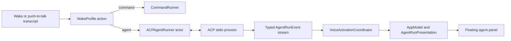

<!--
SPDX-FileCopyrightText: 2026 Alexandru Ciobanu (alex+git@ciobanu.org)
SPDX-License-Identifier: MIT
-->

# ACP agent harness

Voice Activation can route a completed spoken command either to the existing
direct command target or to a local coding agent through Agent Client Protocol
(ACP) version 1. An agent request opens a live, voice-driven conversation that
streams observable work into a floating macOS panel while the foreground
application keeps keyboard focus.

This document defines the first supported agent-harness contract. ACP version
2 is experimental and is deliberately out of scope.

## Product contract

Every wake profile keeps its wake phrase, accent, enabled state, and optional
push-to-talk shortcut. Its run target is one of:

- **Command:** the current absolute executable plus argument templates. At
  least one argument contains `{text}` or `{urlText}`. The executable is
  launched directly without a shell.
- **Agent harness:** an ACP v1 executable, argument vector, working directory,
  provider preset, default permission policy, and optional system prompt. The
  system prompt and recognized command are sent as separate text blocks in
  `session/prompt`; neither is interpolated into a shell command.

Existing saved profiles have no target discriminator. They decode as command
targets without changing their UUID, phrase, accent, enabled state, shortcut,
executable, or argument templates. A failed decode never overwrites the stored
profile data with a default profile.

Settings offer four agent presets:

| Preset | ACP launch command |
| --- | --- |
| Cursor | `cursor-agent acp` |
| Codex | `npx -y @agentclientprotocol/codex-acp@1.8.0` |
| Claude | `npx -y @agentclientprotocol/claude-agent-acp@0.73.0` |
| Custom | User-supplied absolute executable and argument vector |

The adapter versions are pinned so a working profile cannot silently acquire a
breaking protocol change. Selecting a preset fills editable launch fields. When
an empty Agent target is opened for the first time, settings choose the first
locally available preset, preferring Cursor before the `npx`-based adapters.
The executable detector checks the app process's inherited `PATH`, then common
Homebrew, `/usr/local`, `~/.local/bin`, ChatGPT application-resource, and
installed NVM node-version directories. Settings identify whether discovery
came from `PATH`, a known location, NVM, or a directly selected file. Custom
targets may enter a bare command name and resolve it with **Detect**, or choose
a file using the native picker.

The persisted absolute executable path remains authoritative because a Finder-
or login-item-launched application cannot rely on an interactive shell's
`PATH`. Reopening settings never replaces a saved path or edited adapter
arguments automatically.

The app inherits the launch environment and never stores agent credentials in
preferences. Users authenticate the selected agent through its normal provider
CLI before starting a run. The optional ElevenLabs speech credential is separate
from agent authentication and is stored in macOS Keychain.

## Runtime architecture

`VoiceActivationCoordinator` remains main-actor isolated and owns speech state,
capture timing, and execution generations. It pins the matched profile action
when capture begins. A command action follows the current one-shot path. An
agent action calls an injected `AgentHarnessRunning` boundary and publishes
typed run events separately from `ActivationState`.

`ACPAgentRunner` is an actor. It owns provider connections, serialized writes,
request identifiers, pending JSON-RPC continuations, permission decisions, and
process termination. It keeps one initialized ACP process and session per
profile while configuration remains unchanged. A conversation sends multiple
sequential prompt turns through that same ACP session, preserving the agent's
context. Sessions are isolated by profile and every update must carry the exact
session identifier owned by its connection. Up to four profile sessions remain
cached; opening a fifth evicts the least recently used idle process. Returning
to that profile creates a fresh session and shows that its previous context was
released. Only one prompt turn may be active globally. A spoken follow-up during
an active turn first cancels that turn, then starts the follow-up after ACP has
settled cancellation; additional utterances remain ordered.

A cached session is a lease, not a promise that the provider still has it. If a
prompt is rejected with a missing-session error before the provider emits any
session activity or asks for permission, the runner discards the process,
creates a fresh session, and retries that prompt once. The conversation shows a
notice because the provider's earlier context is gone. Ambiguous errors, a
second missing-session failure, and failures after activity begins are never
replayed. After activity begins, streamed output remains visible, the current
turn is marked interrupted, and live conversation input stays open. The next
follow-up gets a fresh provider process instead of risking duplicate agent
actions.

The initial ACP handshake has a 12-second deadline. If the provider stops
responding during startup, the runner terminates that process and starts one
fresh connection. A second startup stall fails the turn with a clear error;
the panel never remains on **Starting the agent** indefinitely.

The process transport disables `SIGPIPE` for child stdin, uses nonblocking
writes, closes the parent write side during termination, drains stdout and
stderr independently, and marks an exited process unavailable immediately. It
keeps current-generation delivery alive for a bounded drain grace so final
updates are not truncated, then closes inherited pipe handles and fails any
pending request. A short post-response settle window catches cross-pipe
diagnostics that arrive with process exit. Stderr is decoded incrementally and
coalesced within its 16 KiB bound before UI delivery.

All events and completions carry the coordinator's execution generation. A
cancelled, replaced, or shut-down run cannot mutate the current UI even if an
old process emits late data.

## ACP v1 wire contract

ACP subprocess communication follows the stable protocol-owner specification:

- UTF-8 JSON-RPC 2.0 over standard input and standard output.
- Exactly one compact JSON value per line; protocol messages contain no
  embedded literal newline bytes.
- Incoming request identifiers preserve the full ACP `int64 | string | null`
  union so permission responses use exactly the identifier sent by the agent.
- Standard error is a separate diagnostic stream and never parsed as ACP.
- Startup calls `initialize` with `protocolVersion: 1`, no filesystem,
  terminal, terminal-authentication, or elicitation capabilities, and Voice
  Activation implementation metadata.
- Session creation uses the provider's ambient CLI authentication. If it
  returns `auth_required`, the connection closes cleanly and the app displays
  the advertised method names with provider CLI login guidance. Voice
  Activation neither guesses among multiple methods nor emulates an interactive
  terminal.
- A fresh `session/new` uses the profile's absolute working directory and an
  empty MCP server list.
- Each initial request and follow-up utterance becomes one `session/prompt` in
  the same profile session, containing a harness instruction text block followed
  by the untouched recognized request. The instruction asks for user-facing
  GitHub-flavored Markdown and limits progress narration to one short sentence
  per work batch. It tells the provider not to narrate individual tool calls or
  routine intermediate results.
- For the Codex preset, the profile system prompt is merged into the adapter's
  `CODEX_CONFIG` as `developer_instructions` before process launch, preserving
  other valid JSON configuration. This gives it developer authority for every
  turn without duplicating it as user text. ACP v1 has no portable system-role
  field, so other presets retain the profile instruction in the harness block.
- `session/update` streams until the prompt response supplies a stop reason.
- A `session/update` for any identifier other than the connection's current
  session is ignored and reported as a bounded diagnostic.

Follow-ups remain ordered behind an active turn. At most 16 may wait; further
recognized requests produce an app-authored notice and are not admitted until
the queue has room.

The client handles every stable ACP v1 update discriminator:

- user and agent message chunks;
- agent thought chunks exposed by the provider;
- tool calls and tool-call updates;
- image, resource-link, and embedded resource content from agent messages and
  tool results;
- complete plan replacements;
- available commands, mode, configuration, and session metadata updates;
- usage updates.

Unknown update types and provider extensions do not crash or end the run. They
appear as bounded diagnostics. Unknown inbound requests receive JSON-RPC
`method not found`; Cursor's blocking question and plan-approval extensions
receive their documented cancelled result and are reported rather than left
pending.

The client does not claim to expose private chain-of-thought. It displays only
content the agent sends through ACP.

## Permission handling

An agent profile has one of five permission policies:

- **Ask:** show the ACP tool description and the agent-provided choices in the
  run panel. Work remains paused until the user chooses or cancels.
- **Allow once:** automatically select an `allow_once` option, falling back to
  `allow_always` only when the agent offers no one-shot choice.
- **Always allow:** select `allow_always` when offered, falling back to
  `allow_once` when the provider exposes only a one-shot choice.
- **Deny once:** select a one-shot rejection when available, otherwise return a
  cancelled outcome.
- **Always deny:** select `reject_always` when offered, falling back to
  `reject_once` and then a cancelled outcome.

The panel displays agent-provided choice labels; it does not invent an approval
the agent did not offer. Selecting any choice collapses that request immediately
and resolves it exactly once. A provider may reuse a wire request identifier
after its earlier prompt disappears; the new prompt remains actionable. The
working-audio delay resumes after a choice is sent. Cancelling a run resolves
every pending permission as cancelled before the process is torn down. Each
displayed choice carries a globally unique opaque turn identifier as well as the
wire request ID, so a
delayed click cannot resolve a reused request ID from a later turn or replacement
connection.

With **Ask every time**, live conversation recognition also accepts exact spoken
decisions. `allow`, `allow all`, `deny`, and `deny all` resolve the oldest
visible permission using ACP option kinds, not localized button text. Exact
agent-provided option labels are accepted too. Longer utterances are left alone
and continue as ordinary follow-ups.

## Streaming presentation

Agent execution uses a separate borderless `NSPanel` at floating level. It
joins full-screen spaces, stays above the active application, and never becomes
the key window. Pointer controls work without moving keyboard focus away from
the user's current application.

The panel opens at the recording overlay's bottom-centred screen and animates
to a preferred 680 by 560 point material surface, shrinking to the complete
visible frame on a smaller display. A native drag surface covers only the
noninteractive provider region and hands mouse-down events to the Window Server,
so the panel moves without taking keyboard focus or intercepting SwiftUI controls.
The minimize control animates it to the screen's top-right below the menu bar and
morphs it into a 372 by 84 point persistent status pill with the provider, latest
activity, phase, and live elapsed time. The pill remains movable and
restores the full conversation at the expanded panel's saved pre-minimize
location. Screen changes clamp that saved frame into the current available
visible area.

The expanded surface contains:

- provider, running phase, elapsed time, and profile accent;
- the immutable spoken request;
- a result-first adaptive shelf for generated images, PDFs, documents, and
  resource links, with native previews when local data is available;
- a live, selectable Markdown timeline that preserves the wire order of agent
  text and tool activity;
- one collapsible **Thinking** row per work burst, created before ACP startup and
  containing expandable reasoning and tool details;
- permission choices when required;
- a live microphone row that shows the current follow-up transcription;
- **Stop turn** while running and **End conversation** throughout the live
  conversation, then **Delete**, **Copy output**, and **Close** after it ends;
  and
- explicit truncation notices when a safety limit is reached.

The transcript auto-follows output, tool, plan, notice, permission, and
voice-input growth only while the view is already pinned near the bottom. A
deliberate user scroll up disables following; returning to the bottom enables it
again. Scroll geometry is sampled throughout interaction and deceleration, so
streamed growth cannot overwrite that decision. Programmatic scrolling and
content growth never misclassify that state.

Agent output does not drive the elapsed clock; the visible timer refreshes on
its own schedule while the agent is running or cancelling. It freezes as soon
as a turn finishes and excludes time spent waiting for the user's follow-up,
then resumes from the frozen value when the next turn starts. This keeps silent
tool calls and long thinking pauses accurately timed without counting idle
conversation time. Footer controls slide and fade between the active,
cancelling, listening, and terminal action sets; reduced-motion mode uses a
short fade instead.

Completing one turn keeps the microphone and conversation open for a follow-up.
Ending the conversation leaves the panel visible for inspection. The menu-bar
panel offers **Open**, **Stop turn**, and **End conversation** while applicable,
then right-aligned **Delete** and **Open** actions after the conversation ends.
Closing the panel keeps its bounded presentation available from **Open**;
**Delete** hides it and releases it from memory. A new conversation reuses the
panel, restores its expanded presentation, and clears the prior in-memory
presentation. Choosing **Open** while the persistent pill is visible also
restores the expanded conversation.

Token bursts publish on leading and trailing edges at a fixed 50-millisecond
cadence. This preserves immediate feedback without making SwiftUI render once
per token. Adjacent answer chunks coalesce only within their current timeline
message. Reasoning and tool calls between two answers collect into one bounded
**Thinking** group; the next answer settles and collapses it. Plans replace
atomically and clear at the start of the next turn. Tool updates retain their
identity inside the group; if a provider omits a terminal tool update, turn
settlement still stops the animation.

Artifact cards never use remote content for previews. ImageIO decodes retained
embedded images off the main actor, while Quick Look receives only existing local
file URLs. Linked `file`, `http`, and `https` resources can be opened explicitly;
only local file links can be revealed in Finder. Opening retained embedded data
creates a private per-run, per-result temporary file with owner-only permissions.
Closing the panel retains it with the conversation, while delete, run replacement,
and app shutdown remove the applicable temporary files.
Simultaneous permissions remain independently actionable, and app-authored
truncation or protocol notices cannot be mistaken for provider output. The
copyable response section separates turns and excludes thought updates, which
remain visible only in the timeline; the full export also includes the request
and bounded diagnostics plus result names and linked URIs, never embedded bytes.

Direct command profiles keep the current short execution state and do not open
the agent panel.

## Live voice, audio, cancellation, and recovery

After the first request, a dedicated conversation recognition session remains
active both while the agent works and while it waits for the next turn. A normal
utterance is appended to the ordered timeline and sent as a follow-up. The
profile's push-to-talk shortcut also contributes a follow-up while that
conversation is open rather than creating a second agent session.

Saying only `cancel`, `stop`, or `dismiss` always ends the whole conversation,
including any active turn. The same command during spoken reply playback stops
the playback before ending. Any other non-empty utterance during narration
stops playback and proceeds through the ordinary final-result or 1.5-second
inactivity boundary as a follow-up. Conversation capture enables best-effort
input voice processing to reduce synthesized reply echo and passes the control
words to the recognizer as contextual hints.

**Stop turn** transitions the turn to `cancelling` immediately,
invalidate its execution generation, respond to pending permissions with a
cancelled outcome, and send `session/cancel` for the active session. The client
waits up to two seconds for the prompt to finish with `stopReason: cancelled`.
Any other post-cancel stop reason invalidates the connection. The runner then
terminates an unresponsive process and discards that cached connection.

**End conversation** cancels an active turn when necessary, closes live
conversation recognition, and resumes passive wake listening after the normal
cooldown.

Settings independently enable spoken agent replies and quiet activity sounds.
Reply speech strips Markdown formatting; fenced code is announced but not read
character by character. Complete sentences enter a FIFO speech queue as soon as
they stream from the agent. A message change or transition to thought, tool,
plan, or permission work flushes unfinished progress text first. A fixed
350-millisecond deadline remains the fallback; later deltas cannot postpone that
deadline. Turn completion flushes only the remainder. The selected provider
is either the locale-matching macOS voice or an ElevenLabs voice selected from
the account's paginated voice catalog and using its
low-latency endpoint and `eleven_flash_v2_5`. Up to two complete segment
syntheses run outside the main actor while prepared audio still plays in strict
order. The app does not decode a partial MP3 response. A failed cloud request
falls back to the macOS voice without discarding later segments. ElevenLabs
audio and credentials remain in memory and Keychain respectively.
A short **Test voice** preview uses the same synthesis path; manual Voice ID entry
remains available when catalog discovery fails.

The voice also acknowledges a spoken conversation cancellation with “Stopped.”
The first thinking cue plays immediately when a request is accepted, including
during ACP process startup, and repeats every 3.2 seconds while the agent remains
busy. Tool start, completion, and failure use
distinct one-shot cues; duplicate ACP status updates do not replay them. Cloud
synthesis does not silence the thinking pulse before audio exists. It stops for
permission choices, actual narration, cancellation, completion, and failure,
then resumes after a 1.6-second delay if work continues after narration. When
cloud audio becomes ready, the queue enters an explicit starting state, stops
the active effect, and begins delegate-tracked playback. Recognition stays alive
at playback start, avoiding a synchronous audio-engine rebuild in front of the
first syllable.

Application shutdown cancels the active turn and terminates every cached ACP
process. Saving changed agent configuration discards the affected cached
connection. The fifth distinct profile session evicts the least recently used
idle connection, keeping subprocess retention bounded. Disabling passive wake
listening does not kill an already-running agent; the explicit agent
cancellation actions own that decision.

Malformed JSON, oversized frames, incompatible protocol versions, unexpected
EOF, non-zero process termination, and JSON-RPC errors become bounded,
user-safe diagnostics. Failure before meaningful activity ends the run. Failure
after activity interrupts only that turn, preserves its output, and keeps voice
follow-up active. A failed connection is never reused.

## Resource and privacy bounds

- A prompt is rejected above 8 KiB of UTF-8 rather than silently truncated.
- At most four ACP profile sessions and their subprocesses remain cached. Cache
  pressure evicts the least recently used idle session.
- At most 16 follow-up prompts wait behind an active turn; overflow produces a
  visible bounded notice and does not cancel the active work.
- One ACP line is limited to 1 MiB before the connection is failed.
- Accepted events waiting between transport ingestion and consumer callbacks
  retain at most 512 KiB of output, 16 KiB of diagnostics, 512 KiB of control
  data, 256 control entries, and 32 pending permissions. Output and diagnostics
  discard their oldest UTF-8-safe content with typed notices; control or
  permission overflow fails the run explicitly.
- One artifact URI retains at most 4 KiB, its media type 256 bytes, each display
  string 8 KiB, and one decoded embedded payload 768 KiB. The delivery channel
  retains at most 4 MiB of whole artifacts and evicts the oldest with one typed,
  coalesced notice.
- Copyable response output retains at most 512 KiB of UTF-8. The rendered
  timeline retains at most 64 KiB and 256 visible activity items, with an
  explicit marker when older activity is omitted.
- Standard-error diagnostics retain the newest 16 KiB.
- The presentation retains the latest 32 tool calls; older completed calls are
  summarized by count.
- The presentation retains at most 32 results and 4 MiB of embedded result data;
  the oldest whole result is omitted first and the UI reports the bounded count.
- The presentation retains the latest 16 app-authored or protocol notices and
  suppresses an immediately repeated notice.
- UI publication is coalesced to at most 20 updates per second during token
  bursts.
- The 1 MiB frame limit bounds parser input; decoding one accepted frame may
  transiently allocate its JSON representation before typed delivery applies
  the retained-queue limits above.
- No audio, prompt history, run history, raw tool payload, or agent output is
  written to durable storage by Voice Activation. A user explicitly opening an
  embedded result creates only the selected temporary file described above.
- The optional ElevenLabs API key is stored as a generic password in macOS
  Keychain. It is not stored in source, `UserDefaults`, logs, or copied output.

Natural prompt completion drains both bounded delivery stages before publishing
success. Forced cancellation and shutdown invalidate the active turn before
discarding queued delivery, so callback re-entry or a suspended completion
cannot publish stale success. At most the callback already in flight may finish
after forced discard, and every UI boundary rejects it by run identifier.

## Verification contract

Tests use deterministic fake transports and runners; CI never calls a paid
model or depends on installed agent CLIs.

- Profile tests cover legacy decoding, new target round trips, validation, and
  preservation of profile identity and shortcuts.
- The NDJSON framer is tested at every input split point, including multibyte
  UTF-8, malformed data, and size limits.
- ACP client tests cover initialize, authentication, session creation, all
  update types, permission responses, unknown messages, JSON-RPC errors,
  cancellation, EOF, stale responses, and cross-session update rejection.
- Runner tests cover isolated profile sessions, deterministic least-recently-used
  eviction, missing-session classification, one-shot recovery, and the
  no-replay boundary after agent activity.
- Process tests prove direct argv launch, separate stdout/stderr draining, and
  bounded cancellation escalation.
- Coordinator tests prove routing, same-session follow-ups, voice interruption,
  ordered streaming, generation isolation, explicit cancellation, shutdown,
  and exactly-once passive restart.
- App tests prove draft round trips, preset resolution, bounded presentation,
  bottom-pinned scrolling policy, silent injected audio behavior, panel actions,
  menu affordances, and nonactivating window configuration.

The complete change must pass the normal Swift test suite, warnings-as-errors
build, Thread Sanitizer, app packaging, property-list validation, code-sign
verification, and the exact pushed commit's CI workflow.

## Primary references

- [ACP v1 overview](https://agentclientprotocol.com/protocol/overview)
- [ACP stdio transport](https://agentclientprotocol.com/protocol/transports)
- [ACP prompt lifecycle](https://agentclientprotocol.com/protocol/prompt-turn)
- [ACP session setup](https://agentclientprotocol.com/protocol/v1/session-setup)
- [ACP tool permissions](https://agentclientprotocol.com/protocol/tool-calls)
- [Cursor native ACP server](https://prod.cursor.com/docs/cli/acp)
- [Codex ACP adapter](https://github.com/agentclientprotocol/codex-acp)
- [Claude ACP adapter](https://github.com/agentclientprotocol/claude-agent-acp)
- [ElevenLabs streaming text-to-speech API](https://elevenlabs.io/docs/api-reference/text-to-speech/stream)
- [ElevenLabs voice catalog API](https://elevenlabs.io/docs/api-reference/voices/search)
- [ElevenLabs low-latency streaming guide](https://elevenlabs.io/docs/eleven-api/guides/how-to/text-to-speech/streaming)
