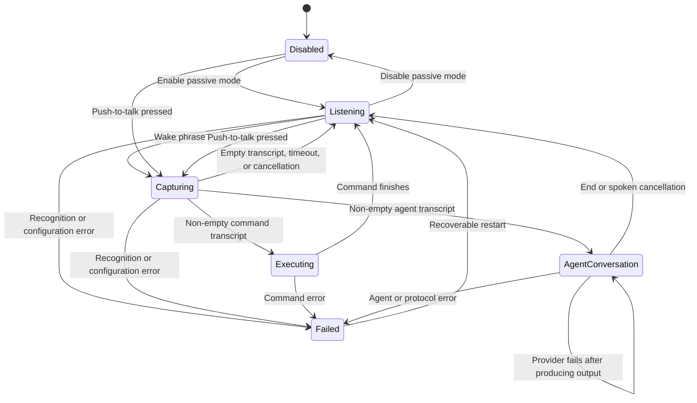

<!--
SPDX-FileCopyrightText: 2026 Alexandru Ciobanu (alex+git@ciobanu.org)
SPDX-License-Identifier: MIT
-->

# Architecture

Voice Activation separates testable speech, direct-command, and ACP-agent
behavior from macOS UI and framework adapters.

## Modules

- `VoiceActivationCore` owns wake matching, state transitions, command
  templates, ACP framing and lifecycle, bounded event delivery, process
  execution, and preferences.
- `VoiceActivationApp` owns the SwiftUI menu and Settings window, Apple speech
  capture, privacy requests, Carbon global shortcuts, and Service Management
  login-item registration. It also owns the non-activating recording overlay
  and streamed agent panel.
- `MenuContentView` renders the menu-bar extra as a material-backed control
  panel with state-specific status presentation, compact profile controls,
  inline shortcut hints, capture cancellation, and application actions.
- `VoiceActivationCoreTests` covers pure coordinator, matcher, template,
  runner, and preference behavior.
- `VoiceActivationAppTests` covers macOS adapter policies, audio callback
  isolation, menu status, and Settings presentation.

Large stateful types are split by responsibility through same-module Swift
extensions rather than by introducing forwarding objects. For example,
`VoiceActivationCoordinator` keeps state ownership in its primary declaration
while speech and execution transitions live in dedicated extension files;
`AppModel` separates lifecycle, configuration, and agent-conversation routing;
and the retained agent panel separates content, activity, and chrome. Helper
types with independent synchronization or bounded-storage invariants live in
their own files. CI enforces the 700-line physical file limit across production
and test code.

`AppModel` is the main-actor bridge between SwiftUI and
`VoiceActivationCoordinator`. The coordinator owns exactly one active speech
session and invalidates callbacks from retired sessions with a generation
identifier. Executions have an independent generation so an older command or
agent callback cannot overwrite a newer capture or execution. It carries
the matched `WakeProfile` through capture before publishing capture state, so
command routing and overlay color cannot drift apart, and publishes current
command text separately from command history.

`WakeProfileCollectionValidator` owns cross-profile invariants. It shares wake
phrase canonicalization with `WakePhraseMatcher`, preventing two visually
different phrases from competing for the same recognized trigger, and rejects
duplicate push-to-talk bindings before adapters mutate system registration.

## State flow

The visible menu-bar state is `Disabled`, `Listening`, `Capturing`, `Running
command`, `Running agent`, or an error message. Agent presentation is separate
from speech state. A completed turn therefore changes the panel to its listening
phase without discarding output or the live conversation; the final panel stays
visible after the conversation returns to passive wake listening.

## Speech modes

- **Passive wake:** the always-listen toggle starts on-device recognition. It
  supplies only individually enabled profiles as contextual vocabulary and
  matching candidates, then restarts after final results and recoverable failures.
- **Command capture:** a wake phrase finalized alone starts recognition that
  may use Apple's speech service. It finishes after 5 seconds without initial
  command text, on a final result, after 1.5 seconds of inactivity following
  text, or at the 30-second absolute maximum.
- **Push to talk:** each profile may persist a distinct Carbon global hotkey that
  starts recognition for that profile and may use Apple's speech service.
  Releasing the shortcut finishes capture. Settings records AppKit key events
  into profile drafts and registers the full binding set only when settings are
  saved.
  The prior registration remains active until that save succeeds and is restored
  if the requested combination is unavailable. Press and release callbacks carry
  the same profile identifier through asynchronous permission checks, preventing
  another binding's release from ending the held profile's capture.
- **Agent conversation:** after an agent request, interactive recognition stays
  active without an initial-silence timeout. Final speech or 1.5 seconds of
  inactivity submits a follow-up, and the 30-second utterance bound still
  applies. Push-to-talk becomes another input method for the open conversation.

When a wake phrase and command arrive in one transcription, the coordinator
uses the remaining text immediately. When the wake phrase is recognized alone,
it starts a dedicated command session so pausing after `computer` does not
discard the next utterance. A partial result containing only the wake phrase
schedules that session after a short grace period instead of waiting for Apple
to close the wake utterance. Command words arriving during the grace period
cancel the handoff and continue through the existing passive result.

The coordinator recognizes `cancel`, `stop`, and `dismiss` as cancellation
words. A lone word cancels only at a completion boundary so a partial `stop`
can still grow into `stop the music`. Two adjacent copies of the same word
cancel immediately in passive command capture or push-to-talk.

`WakePhraseMatcher` checks every enabled profile and chooses the longest matching
phrase. The profile owns its command or agent action, accent color, and optional
push-to-talk binding. A shortcut event identifies its profile before capture
begins, so wake and push-to-talk execute the same pinned profile action.
Passive recognition supplies every enabled phrase to Apple Speech as contextual
vocabulary so uncommon names and intentional spellings are not treated as
ordinary dictation.

## Command execution

Each profile constructs a `CommandTemplate` that validates two invariants before
settings are saved:

1. The executable path is absolute.
2. At least one argument contains `{text}` or `{urlText}`.

`CommandRunner` verifies that the file is executable, expands each argument,
starts `Foundation.Process`, discards process standard streams, and treats a
non-zero exit status as an error. No shell parses the transcript.

## Agent execution

`ACPAgentRunner` is an actor that caches one initialized process and ACP session
per unchanged profile configuration, with a four-session least-recently-used
bound. `ACPClientConnection` owns JSON-RPC request identity, prompt settlement,
permissions, cancellation, exact session routing, and terminal state.
`ACPProcessTransport` owns direct-argument launch and independent nonblocking
stdin, stdout, and stderr lifecycles.

The runner treats a cached session as revocable provider state. A typed
missing-session error may reconnect and replay the prompt once, but only before
the connection has received session output or a permission request. This keeps
stale-session recovery automatic without risking duplicate tool actions.
Updates carrying another session identifier are ignored rather than entering
the active conversation. Any other connection failure discards the cached
record. If that turn already produced meaningful activity, the coordinator
preserves its output, returns the panel to live listening, and lets the next
utterance create a fresh session.

The client accepts ACP v1 newline-delimited UTF-8 JSON-RPC, preserves integer,
string, and null request identifiers, and converts stable updates into typed
`AgentRunEvent` values. Agent-message and tool-result image, resource-link, and
embedded resource blocks become bounded `AgentArtifact` values instead of raw
provider dictionaries. A two-stage bounded delivery path separates transport
ingestion from consumer callbacks so a slow panel cannot grow memory without
limit. Each delivery consumer runs at user-initiated priority rather than
inheriting the quality of service of the speech or process callback that created
it. Main-actor delivery then passes through `MainRunLoopScheduler`, an ordered
bridge registered in the default, common, modal-panel, and event-tracking modes.
This matters because AppKit may keep panels interactive inside a nested tracking
loop while ordinary main-actor task continuations wait for the default loop.
The bridge awaits each streamed event so the bounded ACP queues retain
backpressure. Natural completion drains accepted events; forced cancellation
invalidates the turn first and discards queued delivery.

Initial agent launch overlaps the synchronous conversation-recognition rebuild.
A 25-millisecond cancellation grace precedes runner entry so a stop action from
the same input turn remains authoritative without putting the much slower audio
setup back on the ACP startup path.

Startup credential retrieval treats macOS Keychain access as blocking foreign
work. `SecItemCopyMatching` runs on a dedicated user-initiated dispatch queue,
never on Swift's cooperative executor, so a slow security service cannot starve
ACP delivery, presentation timers, activity sounds, or speech synthesis. The
diagnostic writer uses its own user-initiated serial queue as well. Permission,
credential, ACP delivery, narration, synthesis, and main-actor handoff records
include priority and monotonic stage timing where relevant.

`AgentRunPresentation` applies only events carrying the active run identifier,
retains bounded output, diagnostics, tools, plans, artifacts, and simultaneous
permission requests, and reduces visible text and tool events into one ordered
timeline.
It creates one active thinking group as soon as each turn starts. Provider
reasoning and tool updates mutate details inside that group; the next answer
settles it and remains after the work that preceded it. Token bursts publish to
SwiftUI at no more than 20 updates per second. `AgentRunPanelController` hosts
the Markdown renderer, result shelf, and expandable activity model in a
non-activating floating `NSPanel`. The shelf asks ImageIO for embedded-image
previews and Quick Look only for existing local file URLs; remote resources are
never preview-fetched. Explicit Open materializes retained data in owner-only
temporary run directories, and the presenter owns their cleanup on delete, run
replacement, and shutdown. The recording overlay passes its exact final frame
into the initial panel morph. Minimization
stores the expanded frame separately from the top-right notification geometry,
so restoration returns to the user's previous location.

One presentation run identifier spans the whole conversation. User follow-ups,
agent messages, and tools share one chronological timeline while individual ACP
turns remain sequential. At most 16 recognized follow-ups wait behind active
work; further submissions produce a visible notice. Beginning a turn clears the
prior plan, the copied response section separates turns and excludes thought
updates, and tools still marked pending settle when their turn ends. The panel's
bottom-follow policy tracks geometry throughout user interaction and changes
only on user-driven scrolling; output growth and animated programmatic scrolling
cannot disable it.

`AgentConversationAudioPresenter` observes typed lifecycle events and sends
user-facing message deltas to `AgentNarrationSegmenter`. Complete Markdown
sentences enter speech immediately. A changed message identifier or transition
to thought, tool, plan, or permission work flushes an unfinished progress
message before that work starts. The 350-millisecond deadline is the fallback
for providers that expose neither punctuation nor a semantic boundary.

`AgentSpeechQueue` owns speech order, synthesis lookahead, playback, fallback,
and cancellation epochs. It starts up to two ElevenLabs requests outside the
main actor and may receive them out of order, but starts audio only in submission
order. Queue state is explicit: `preparing`, `starting`, `playing`, or
`idle`. Cloud preparation therefore does not silence activity audio, while
`starting` stops the current effect before playback begins. Native speech and
cloud audio report completion through framework delegates instead of polling
`isSpeaking` or `isPlaying`. Recognition updates, synthesis completion,
narration flushing, activity pulses, capture deadlines, and throttled panel
publications all use the mode-aware main-run-loop bridge. They therefore remain
live while a menu, floating panel, drag, or control is tracking input.

`AgentActivitySoundLoop` owns only working and tool sounds. It starts
immediately with the accepted request, repeats while speech is preparing, pauses
for audible narration, and resumes after its initial delay if work continues.
`AgentConversationAudioOrchestrator` is the small arbitration boundary between
that loop and the speech queue; it does not synthesize, poll, or schedule audio.
Spoken conversation cancellation gets a short acknowledgement.
An injected, paginated ElevenLabs catalog boundary discovers named voices, while
the preview boundary reuses speech synthesis without coupling Settings to
`NSSound`. Tests inject silent catalog, synthesizer, audio-data, preview, and
activity-sound adapters.

See [ACP agent harness](agent-harness.md) for the complete wire, permission,
resource, and recovery contract.

## Concurrency and lifecycle

- Coordinator and app-model mutation is isolated to the main actor.
- Foreign callbacks and delayed work enter that actor through an ordered
  run-loop-mode-aware bridge instead of assuming AppKit is in its default mode.
- The real-time audio tap appends buffers through a sendable sink without
  crossing into main-actor state.
- Mode changes cancel inactivity and maximum-duration tasks, stop the audio
  engine, remove its input tap, and cancel the recognition task.
- Recognition callbacks carry a session generation and are ignored after that
  session is stopped.
- A bare partial wake phrase schedules a command-capture handoff after a short
  grace period. Same-utterance command text cancels it; late final callbacks
  from a retired wake session are ignored.
- Empty final recognition results restart the command recognizer within the
  existing capture window; they do not reset its initial-silence or absolute
  deadlines.
- Command execution runs asynchronously and returns to passive listening after
  a short cooldown.
- Agent turns remain independently cancellable with **Stop turn** while their
  conversation speech session continues. Spoken cancellation or explicitly
  ending the conversation resumes passive listening. Stale events are rejected
  by execution generation and conversation run identifier at the coordinator,
  app model, and presentation boundaries.
- Application shutdown prevents delayed microphone-permission results from
  restarting passive listening or a held push-to-talk capture.
- Pausing passive listening while the startup permission request is open remains
  authoritative when that request eventually completes.
- During synthesized reply playback, the first non-empty recognized utterance
  stops narration and continues through the normal follow-up finalization path.
  Exact cancellation words still stop playback and close the conversation.
  Playback start does not tear down and rebuild recognition; completion starts a
  fresh recognition session to clear captured output before the next utterance.
  Conversation capture requests best-effort input voice processing to reduce
  synthesized output echo without making unsupported hardware a capture error.
- One app-lifetime `LaunchAtLoginSetting` reads and changes
  `SMAppService.mainApp` registration; macOS remains the source of truth instead
  of a duplicated preference. Its synchronous Service Management/XPC boundary
  runs on a dedicated serial utility queue, so constructing or updating the
  hidden Settings scene cannot starve the main actor, live agent output, speech,
  or activity-sound scheduling.
- `RecordingOverlayPresenter` maps capture state to a
  `RecordingOverlayController`. Its borderless `NSPanel` joins full-screen
  spaces, does not activate the app, and follows the screen containing the
  pointer. The panel frame matches the visible surface exactly and animates
  between bottom-centered compact and expanded geometry. A single retained
  SwiftUI hierarchy interpolates the microphone, capsule, transcript, and
  cancel control instead of swapping complete views. Its gradients derive from
  the active profile. The view keeps the full transcript in application state
  while rendering a word-aware tail, ensuring newly recognized speech remains
  visible without changing command input. `CaptureSoundPresenter` observes
  state edges and plays a bundled rising cue on entry to capture and a
  descending cue on exit. `SystemAgentActivitySoundPlayer` uses the same sound
  family for thinking and typed tool transitions. Both fall back to distinct
  system sounds only if an asset cannot load. The panel accepts pointer input
  only so its cancel control can abort capture.
- The menu profile list is a bounded scrolling region, so user-defined profile
  counts cannot grow the menu-bar panel beyond the available screen.
- The agent panel uses the same non-activating window contract, supports pointer
  permissions, turn cancellation, and conversation exit without stealing
  keyboard focus. It follows live output only when already at the bottom and
  remains visible after completion for selection, result opening, and copying.
  Its preferred 680 by 560 point surface adapts down to the display's complete
  visible frame, uses one semantic material or an opaque Reduce Transparency
  fallback, and keeps generated results ahead of implementation activity. The
  borderless panel overlays a native AppKit drag surface on its noninteractive
  header region and hands mouse-down events to the Window Server.
  Whole-background dragging stays disabled so SwiftUI controls remain clickable.
  Minimizing animates the
  same window and model to a compact persistent status presentation at the
  visible screen's top-right below the menu bar;
  restoring returns to the saved expanded location on its owning display and
  adapts the size when that display's visible area has changed.
- Conversation recognition offers exact spoken permission commands to the app
  model before submitting an utterance as a follow-up. The model resolves the
  oldest presented request by typed ACP option kind, so transport code never
  interprets natural language.

## Privacy boundary

Passive wake recognition sets `requiresOnDeviceRecognition` and refuses to run
when the locale lacks on-device support. Interactive command capture can use
Apple's speech service. Conversation sessions request Apple's input voice
processing to reduce playback echo and continue without it when unavailable.
Audio is not stored. Partial text exists in memory only
during the current capture; the most recent submitted request remains for menu
feedback. Conversation prompts, output, diagnostics, plans, tools, and
permissions are bounded in memory and never persisted by the app. A
profile-specific system prompt is saved only as explicit profile configuration.
Pending spoken follow-ups and app-authored notices are bounded independently.

Next: [development and verification](development.md).
