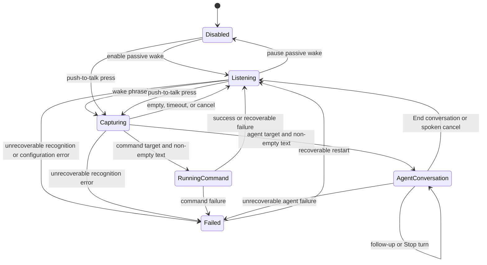

<!--
SPDX-FileCopyrightText: 2026 Alexandru Ciobanu (alex+git@ciobanu.org)
SPDX-License-Identifier: MIT
-->

# Architecture

Use this guide to locate a subsystem and its owner. It describes package
boundaries and the top-level runtime flow; focused guides own protocol,
concurrency, privacy, and user-workflow details.

## Package boundaries

```text
Sources/VoiceActivationCore/       Framework-independent policy and execution
  Profiles/                        Profile identity and validation
  TextToSpeech/                    Persisted backend and voice selections
Sources/VoiceActivationApp/        macOS adapters, composition, presentation
  Profiles/                        Profile presentation and editing models
  Settings/                        Settings composition and profile editors
  TextToSpeech/                    Registry, adapters, credentials, playback
Tests/VoiceActivationCoreTests/    Core and protocol contracts
Tests/VoiceActivationAppTests/     App, presentation, and adapter contracts
```

`VoiceActivationCore` owns state transitions, matching, validation, command
templates and execution, ACP framing and lifecycle, bounded event delivery,
main-run-loop scheduling, diagnostics interfaces, and non-secret preferences.
It does not import SwiftUI or AppKit.

`VoiceActivationApp` owns dependency composition, Apple Speech and permissions,
Carbon shortcuts, Service Management, Keychain, ElevenLabs, JSONL diagnostics,
SwiftUI views, and non-activating AppKit panels.

`MenuContentView` owns its material and border, so its AppKit bridge disables
the duplicate system window shadow when the window-style `MenuBarExtra` mounts
and after structural resizing. Text-only updates do not trigger that bridge.

Stateful owners use same-module extensions to split implementation by
responsibility without adding forwarding objects. The coordinator separates
speech and execution transitions; `AppModel` separates lifecycle,
configuration, and conversation routing; ACP connection and runner types split
wire, delivery, and process concerns; the agent panel splits model, content,
activity, chrome, and placement.

## Runtime composition

`VoiceActivationApp` is the composition root. It builds `AppModel`, which
bridges menu and Settings state to the main-actor
`VoiceActivationCoordinator`. Replaceable boundaries keep framework calls out
of Core policy and tests:

```text
VoiceActivationApp
  ├─ UserDefaultsAgentContinuityStore
  └─ AppModel ← shared continuity store
      ├─ VoiceActivationCoordinator
      │   ├─ SpeechSessionProtocol → AppleSpeechSession
      │   ├─ CommandRunning → CommandRunner
      │   └─ AgentHarnessRunning → ACPAgentRunner
      │       ├─ ACPClientConnection
      │       │   ├─ ACPEventDecoder → AgentResponseChannelRouter
      │       │   └─ ACPProcessTransport
      │       └─ same shared continuity store
      ├─ RecordingOverlayPresenter → non-activating NSPanel
      ├─ AgentRunPresentation → AgentRunPanelPresenter
      ├─ AgentConversationAudioPresenter
      │   ├─ AgentSpeechQueue ─┐
      │   ├─ Voice preview ────┴→ TextToSpeechBackendRegistry
      │   │   ├─ SystemTextToSpeechBackend
      │   │   └─ ElevenLabsTextToSpeechBackend
      │   └─ AgentActivitySoundLoop
      ├─ PushToTalkShortcut
      ├─ LaunchAtLoginSetting
      └─ JSONLVoiceActivationDiagnosticRecorder
```

Application startup is an app-wide readiness barrier. `AppModel` reconciles
persisted active work to interrupted state before it checks Mac-context access,
loads credentials, registers shortcuts, requests speech permissions, starts
passive listening, or arms application-activation monitoring. Settings and
push-to-talk effect paths remain disabled until that generation-owned startup
attempt reaches ready; cancelled or stale attempts cannot re-arm runtime work.

## Speech and capture

`VoiceActivationCoordinator` owns exactly one speech mode at a time: passive
wake, command capture, push-to-talk, or agent conversation. `AppleSpeechSession`
adapts `SFSpeechRecognizer` and `AVAudioEngine`; `SpeechRequestPolicy` chooses
on-device requirements; `SpeechVoiceProcessingPolicy` requests best-effort echo
reduction for live conversations.

`WakePhraseMatcher` selects the longest enabled prefix match.
`WakeProfileCollectionValidator` owns cross-profile uniqueness. The coordinator
pins the matched profile before publishing capture state, so target, accent, and
shortcut identity cannot drift during asynchronous permission work.

Agent conversation audio resolves the selected profile's inherited, disabled,
or explicit speech preference once when the conversation starts. Follow-up
turns retain that backend, voice, and global backend credential snapshot even
when Settings changes.

Settings voice previews use that same backend registry and preparation contract,
including the global credential lookup. The preview player owns only the sample,
cancellation generation, and playback of the prepared system voice or audio.

The recording overlay is a retained, non-activating AppKit panel hosting one
SwiftUI hierarchy. It follows the active screen, shows only capture state, and
keeps the complete transcript in application state while rendering a bounded
word-aware tail.

See [Wake profiles](wake-profiles.md) for recognition modes, matching, and timing.

## Direct-command execution

`CommandTemplate` validates an absolute executable and explicit argument
templates. `CommandRunner` expands the recognized text, starts
`Foundation.Process` without a shell, waits asynchronously for termination, and
maps a non-zero status to a user-visible error.

See [Command targets](command-targets.md) for configuration and expansion.

## Agent execution and presentation

`ACPAgentRunner` serializes turns and retains a bounded least-recently-used set
of initialized profile sessions. `ACPClientConnection` owns request identity,
one active prompt, update decoding, permissions, and connection terminal state.
`ACPProcessTransport` owns direct process launch and independent standard-stream
lifecycles. A bounded two-stage delivery path preserves order and backpressure
between transport ingestion and the app.

ACP v1 has no standard spoken-response channel. `ACPEventDecoder` recognizes the
optional `ciobanu.org.voiceActivation` version-1 metadata on text content blocks,
then `AgentResponseChannelRouter` passes typed content literally or recognizes
the exact current-adapter marker stream. Unmarked text, malformed metadata, and
marker mismatches retain their original legacy event and text. Routed events then
cross the existing bounded delivery and run/session/source identity gates.

The runner also compares a saved profile bookmark with a versioned fingerprint
of the current provider preset, executable, ordered arguments, working folder,
and validated, trimmed system prompt. Only an exact match may reach
capability-gated `session/load` or `session/resume`; otherwise the saved opaque
ID is removed before the provider process starts. The shared continuity store
persists no conversation content.

`AgentRunPresentation` reduces typed lifecycle and ACP events into one bounded
conversation timeline plus a deduplicated result collection. Agent-authored
spoken text remains visible in a labelled spoken-response row; display text uses
the rich response path; legacy text remains visible as before. The panel
presenter rejects stale run actions and hosts a result-first layout in a
non-activating floating panel. Embedded image bytes are decoded off the main
actor; Quick Look previews only existing local files. Explicit open and reveal
actions cross a generation-checked workspace boundary, and private materialized
files follow run deletion and application shutdown.

The app-owned Markdown boundary uses MarkdownUI's `cmark-gfm` parser with
semantic panel styling, bounded credential-free HTTPS image loading, and an
`http`/`https` link allowlist; no WebKit surface or raw HTML execution enters the
panel. Image bytes are capped before off-main Image I/O downsampling and remain
in a bounded memory-only cache.
`AgentConversationAudioPresenter` maps the same typed lifecycle into narration
and activity cues without making the presentation model own audio playback. It
narrates only a complete admitted spoken unit or the compatible legacy reply
path. Display responses, tools, plans, thoughts, permissions, diagnostics, raw
ACP data, and restored history never become speech. Reply-reading settings still
gate narration; when ElevenLabs is selected, only the admitted spoken text leaves
the Mac for synthesis.

See [ACP agent harness](agent-harness.md) for the wire contract and
[Agent conversations](agent-conversations.md) for the user-visible model.

## Settings and persistence

`AppModel` exposes editable Settings drafts separately from the last validated
profiles used by the coordinator and global-shortcut adapter. Save validates the
whole profile collection before persistence or shortcut replacement. A failed
shortcut registration restores the previous set.

`AppPreferences` stores profiles and non-secret choices in `UserDefaults` with
backward-compatible migration. `KeychainAgentSpeechCredentialStore` owns the
optional ElevenLabs credential. `LaunchAtLoginSetting` treats
`SMAppService.mainApp` as the source of truth rather than duplicating its state
in preferences.

`UserDefaultsAgentContinuityStore` separately owns strict schema-1,
identifier-only ACP bookmarks and work markers. Core policy supplies the same
64-bookmark/64-marker bounds and exact-key lifecycle to durable and in-memory
adapters. Production composition passes one store actor to both `AppModel` and
the actual `ACPAgentRunner`, so launch reconciliation and prompt publication
cannot observe different state.

See [Configuration reference](configuration.md) for fields and persistence.

## Diagnostics

Core services depend on `VoiceActivationDiagnosticRecording`, a metadata-only
interface. The app supplies a bounded rotating JSONL recorder. Call sites emit
typed lifecycle events, counts, identifiers, outcomes, and timings—not prompts,
transcripts, credentials, provider content, or audio.

Response-channel diagnostics follow the same boundary. They record content-free
`event_kind` values such as `agent_message_delta`,
`agent_spoken_message_delta`, `agent_display_message_delta`, and
`agent_spoken_narration_suppressed`; they never record response text,
marker-adjacent content, `_meta` payloads, or speech bytes.

Continuity narrows this further: its store and restoration lifecycle events do
not emit session, turn, task, occurrence, restoration-token, or fingerprint
values. They use fixed operations, capability booleans, counts, activation
categories, error types, and timings.

See [Diagnostics](diagnostics.md) for the trace and investigation workflow.

## State flow

This conceptual flow separates the agent conversation from the coordinator's
compact `executing` state because the panel and microphone remain live between
turns:



Independent speech and execution generations reject callbacks from retired
operations. One conversation run identifier spans its turns; each ACP turn and
permission request carries narrower identity. See
[Concurrency and lifecycle](concurrency-and-lifecycle.md).

## Deeper contracts

- [Wake profiles](wake-profiles.md) — speech modes, matching, capture, and
  push-to-talk.
- [ACP agent harness](agent-harness.md) — provider process, protocol, sessions,
  permissions, cancellation, and recovery.
- [Concurrency and lifecycle](concurrency-and-lifecycle.md) — isolation,
  identities, delivery, cancellation, and shutdown.
- [Privacy and security](privacy-and-security.md) — trust boundaries,
  persistence, redaction, and resource limits.
- [Testing](testing.md) — deterministic boundaries and proportional verification.

## Related guides

- [Documentation index](index.md)
- [Development](development.md)
- [Diagnostics](diagnostics.md)
- [Documentation maintenance](documentation.md)
